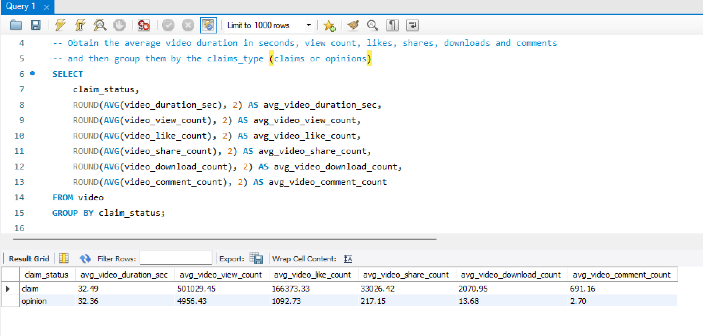
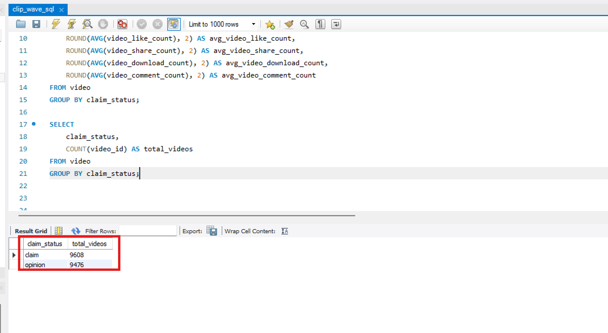
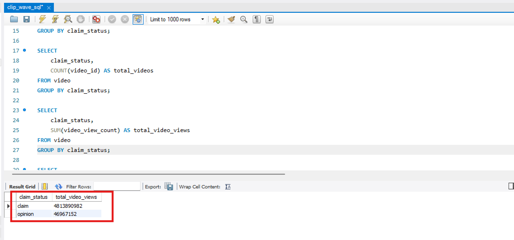
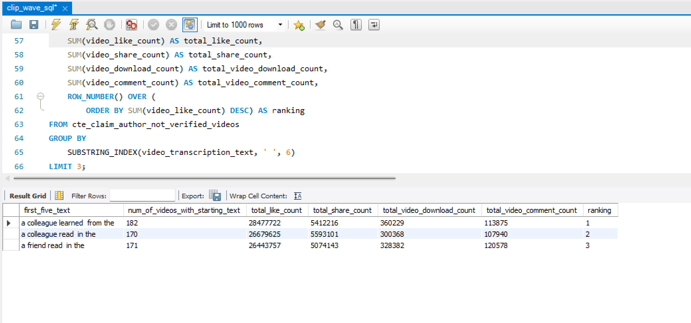
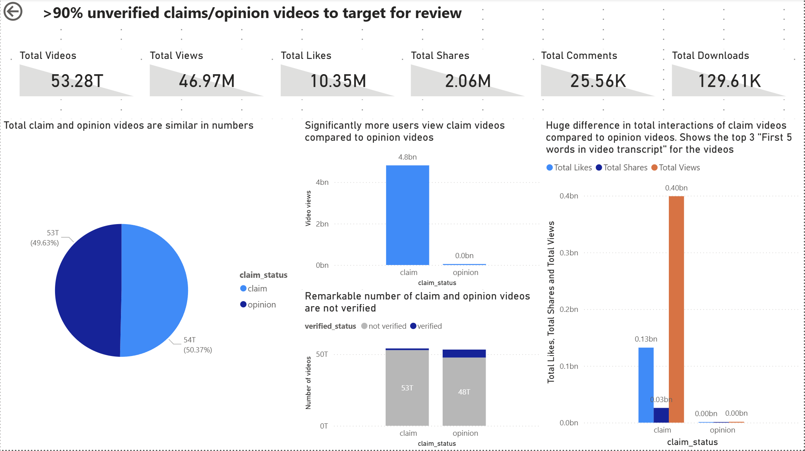

# ClipWave

## Business Context
ClipWave is a fast‑growing short‑form video platform operating across Southeast Asia, with a large user base in Singapore and neighboring markets. As the platform scales, user‑generated “claims” content (statements that sound factual) is surging, raising reputational, regulatory, and user‑trust risks if misleading or unverifiable claims go unmoderated.
​
Content Moderation & Integrity (Trust & Safety) owns policies for claims, while Operations handles review queues and escalations. Senior leadership wants standardized reporting on how claims flow through the system and which types of claims drive exposure, appeals, or enforcement actions such as author bans.
​
## Problem Background
The platform has received increased scrutiny from advertisers and regulators about misinformation risk, especially around science, health, and civic topics that can appear in seemingly “fun facts” videos. Internal audits show inconsistent moderation outcomes: some high‑reach claim videos are left “not verified” with no action, while others lead to bans even at similar view levels.

Currently, teams pull ad‑hoc spreadsheets of claims with limited breakdowns by status, reach, and enforcement decisions, making it hard to answer questions like “Where are our biggest misinformation exposures?” or “Which claims should be prioritized for fact‑checking?” Leadership wants a robust analytics view built from the raw claims‑level dataset already exported from the platform.

Ps. This dataset is obtained from Kaggle website from Murilo Zangari: https://www.kaggle.com/datasets/murilozangari/tiktok-claim-analysis.
​
## Stakeholder Request (Problem Statement)
“We need a clear, repeatable report on claims content: how much of it we have, how widely it is viewed, how it’s being moderated, and where the biggest risks are so we can refine our policies and reviewer guidelines.”
​
## Phase 1: Define problem
Based on the stakeholder, he/she wants a clear report on claims content and these are the data he/she needs to visualize:
- How much of those content we have?
- What is the view count for these content? 
- What are the moderations currently being done?
- Which claims content bring about the most risk to the company? Then with that data, what are some policies and guidelines that needs to be refined to reduce the risk?

So based on the above questions, I have come up with some objectives to be met:
- Quantify exposure of claims/opinions on the platform: Compare the reach and engagement of the claims vs opinions to differentiate which content dominates the platform
- Identify failing moderations workflow: Find out where exactly is the content that is not verified and the author has not been banned yet
- Segregate content by topics: Find out which type of content by topics domininate ClipWave's space
- Provide a clear view of potentially high-risk claims/opinions content: To pinpoint potential high-risk claims/opinion content so that logic rules can be put in place to quickly flag them for review
- Suggest revised guidelines: Based on the data analyzed, provide revision to guidelines to tackle pressing claims/opinion content

## Phase 2: Clean dataset
Since the dataset is from Kaggle and already collected, we can move on to cleaning the dataset.

Looking through the dataset, I noticed multiple records that have (Blanks) as the "claim_status". Since it does not provide any insights, I deleted these records.

These are the columns in the dataset for understanding:
- id: Unique identifier for a video with claim or opinion
- claims_status: Video that is identified as a claim or opinion. In this dataset, an “opinion” refers to an individual’s or group’s personal belief or thought. A “claim” refers to information that is either unsourced or from a unverified source. (based on author)
- video_id: Random unique identifier number for a published video on ClipWave
- video_duration_sec: Duration of video in seconds
- video_transcription_text: Text transcripted from the published video
- verified_status: Verification status of the user that published the video ("verified" or "not verified")
- author_ban_status: Status of the user in terms of their permissions ("active", "under scrutiny", "banned")
- video_view_count: Total number of times the published video was viewed
- video_like_count: Total number of times the published video was liked
- video_share_count: Total number of times the published video was shared
- video_download_count: Total number of times the published video was downloaded
- video_comment_count: Total number of comments on the published video

## Phase 3: Analyze dataset
To better analyze the dataset, I decided to import the CSV data into MySQL.

First we want to look at engagement and reach of the videos between claims vs opinions to have an understanding of which one dominates the platform.
I created this query to find the average of the metrics of engagement and reach (view count, likes, shares, downloads and comments) for us to easily differentiate between claims and opinions.

Then I want to query to obtain the videos segregated by the content type and total number of videos for that content type. So this answers the question of how much of these content we have.

Additionally, we can also see the total number of video views based on the content_type.

Afterwhich, I created a CTE to obtain a subset of the dataset. This CTE contains those claim videos where the content is not verified and the author is still active.
From this subset, I obtained the 5 words commonly used in the transcript of the claim videos from the 3 videos with the highest like counts.

It seems like the top phrases in claim videos based on likes are:
-  "a colleague learned from the"
-  "a colleague read in the"
-  "a friend read in the"

## Phase 4: Visualize dataset
- Pie Chart (Number of videos (claims or opinion)): Visualizes the total number of videos categorized as claims or opinion.
- Column Chart (Video views (claims or opinion)): Displays the total number of video views categorized as claims or opinion.
- Stacked Column Chart (Verified videos (claims or opinion)): Depicts the relationship of verified videos with the category of claims status.
- Clustered column chart (Total metrics of videos (claims or opinion)): Shows the relationship of the total likes, total views and total shares categorized as claims or opinion. As you drill down into each claims_status category, you can see the top 3 first 5 words used in the videos with the most likes, views and shares.

## Phase 6: Data-Driven Action (Insights and Analysis)
Key Findings:
- The number of claim videos are slightly more than the number of opinion videos. Claim videos is 50.37% while opinion videos make up 49.63%. 
- Claim videos bring in significantly more views than opinion videos.
- There are more claim videos that are not verified compared to opinion videos.
- Claim videos bring in significantly more views, likes and shares compared to opinion videos.
- The top 3 first 5 words used in the claim videos with the most views, likes and shares are:
    - "a colleague learned from the"
    - "a colleague read in the"
    - "a friend read in the"
- The top 3 first 5 words used in the opinion videos with the most views, likes and shares are:
    - "i am willing to wager"
    - "my colleagues are willing wager"
    - "my colleagues point of view"

Recommedations:
- Early Intervention Reviews: ClipWave can implement machine learning to pinpoint content swiftly where video posters start with the top 3 sentences above or something similar to reduce the time taken for these videos to be reviewed.